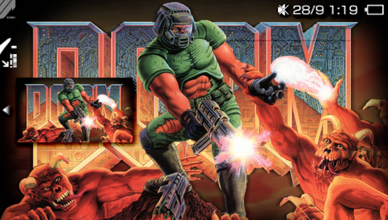
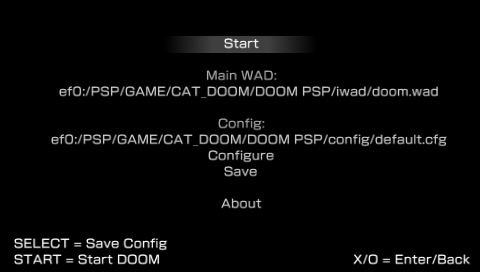
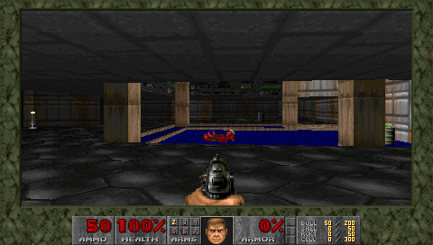

# Doom PSP

Chilly Willy's Doom v1.4 for the PSP (2007), rebuilt with a modern toolchain, a redesigned launcher and remapped controls.

<p align="center">
  
  
  
</p>

## Controls

| Button | In game |
| --- | --- |
| Analog stick | move / strafe |
| L / R | turn left / right |
| D-Pad ← / → | previous / next weapon |
| D-Pad ↓ | toggle automap |
| D-Pad ↑ | whole-map zoom (map open) |
| SQUARE | fire |
| CROSS | run |
| TRIANGLE / CIRCLE | use |
| START | menu (pauses single player) |
| SELECT + ← / → | gamma down / up |
| SELECT + ↓ | toggle detail |

- Weapon cycling works like the PC number keys: fist/chainsaw and shotgun/super shotgun share a slot.
- In the Doom menu: D-Pad or stick moves, CROSS selects or answers yes, CIRCLE goes back or answers no, START closes it.
- Savegames are named automatically as map, skill and date, e.g. `E1M3 H 09-30 14:22` (skill: E, M, H, H+, H++ from ITYTD to Nightmare). Saving over a used slot asks for confirmation.
- **Configure > Controller** options: *Movement = DPad* swaps the D-Pad and the stick. *L/R = Strafe* makes the triggers strafe and the stick turn. With *L/R = Turn*, turning is 1.5x faster than vanilla.

## Cheats

Hold SELECT, optionally R or L, and press a face button. That gives 12 slots, one for each Doom cheat. The default bindings in `config/default.cfg` are:

| Button | SELECT + button | SELECT + R + button | SELECT + L + button |
| --- | --- | --- | --- |
| TRIANGLE | God Mode (iddqd) | Invulnerability (idbeholdv) | No Clipping (idclip) |
| SQUARE | All Weapons (idfa) | Berserk (idbeholds) | Chainsaw (idchoppers) |
| CIRCLE | Keys, Weapons and Ammo (idkfa) | Invisibility (idbeholdi) | Automap Power-up (idbeholda) |
| CROSS | Light Amplification Visor (idbeholdl) | Radiation Suit (idbeholdr) | Full Map (iddt) |

Every slot can be changed or set to none in **Configure > Cheats**.

## Quick start

1. Copy this folder to `PSP/GAME/` on the memory stick.
2. Put a main WAD in `iwad/`. Shareware `doom1.wad` is included.
3. Run it from the XMB, press START.

```
EBOOT.PBP, dvemgr.prx   the program
config/                 launcher configs (default.cfg) and Doom's .doomrc
saves/                  savegames
midi/                   MIDI_Instruments (rename MIDI_Instruments-alt to use the alternate set)
iwad/  pwad/  deh/      main WADs, patch WADs, DeHackEd patches
source/                 source code and build assets (not needed on the PSP)
```

## Launcher

The root menu shows **Start**, the **Main WAD** in use, the **Config** file in use (select it to load another one), **Configure**, **Save** and **About**.

- START runs Doom from any menu. SELECT saves the config from any menu.
- D-Pad ↑/↓ moves, ←/→ changes the value. CROSS enters, CIRCLE goes back. They are swapped on firmware where CIRCLE confirms.
- `config/default.cfg` loads at startup. **Save** asks for a name through the on-screen keyboard.
- **Quit Game** in Doom returns to the launcher. HOME exits to the XMB.

| Configure | Options |
| --- | --- |
| CPU | clock: default, 133 to 333 MHz |
| Video > LCD | 480x272 / 368x272 / 320x240, vsync, detail, 4:3 or 16:9 |
| Video > TV | (Slim, AV cable) 720x480 / 704x448 / 640x400, vsync, detail, interlace, aspect, center screen |
| Video > Display | LCD or TV |
| Sound | update rate 140/70/35 Hz, sound effects, music |
| Controller | calibrate stick, Movement, L/R |
| Cheats | the 12 SELECT cheat slots |
| File | main WAD, up to 4 patch WADs, up to 4 DEH files |
| Game | no monsters, respawn, fast, turbo, map overlay, rotate map, demos |
| Network | net game, player number, deathmatch, skill, map, timer, access point, player addresses |

## WADs

Main WADs are identified by file name:

| Game | File |
| --- | --- |
| Shareware Doom | `doom1.wad` |
| Registered Doom | `doom.wad` |
| The Ultimate DOOM | `doomu.wad` |
| Doom II | `doom2.wad` |
| Final Doom: Plutonia / TNT | `plutonia.wad` / `tnt.wad` |

- Patch WADs go in `pwad/`, DeHackEd `.deh` files in `deh/`. You can load up to four of each.
- These don't work: PlayStation WADs, Heretic/Hexen, FreeDoom (it needs BOOM), and broken WADs with empty maps. Broken WADs show an error instead of crashing.

## Networking

Only TCP/IP Infrastructure (Wi-Fi access point) is supported.

1. All players use the same WADs and game settings.
2. Each player sets **Play Network Game** on and picks a different **Player Number**.
3. Each player enters the IPs of the *other* players in **Network Player #1..3**. The local IP is shown in the same menu.

It can also play against PC ports such as SDL Doom v1.10 with **Use PC Checksum**. HOME aborts a stuck connection.

## Building

This needs Docker (image `pspdev/pspdev`). `make snd0` also needs ffmpeg and wine: Sony's at3tool is a Windows exe, run through wine on Linux.

The at3tool comes from the [ATRACTool-Reloaded](https://github.com/XyLe-GBP/ATRACTool-Reloaded) portable release. `make snd0` fetches it on first use, or run `source/tools/fetch-atractool.sh` (unpacks to `source/tools/ATRACTool-Rel-Portable/`, git-ignored).

```
make            PARAM.SFO + EBOOT.PBP + dvemgr.prx
make snd0       encode source/xmb/bgm.wav to SND0.AT3 (XMB music)
make deploy     run ./deploy.sh (local rsync script, not in the repo)
make clean | shell | pull
```

---

## About this project

### Improvements

- **Build**: compiles with the current pspdev toolchain in Docker (compatibility flags for 2007 code). There are `make` targets for PARAM.SFO and SND0 (the at3tool is downloaded by a script).
- **Layout**: the root folder is the distributable game folder. Configs moved to `config/` and saves to `saves/`. Code and build assets are in `source/` (`src`, `dvemgr`, `include`, `lib`, `xmb`, `tools`).
- **XMB**: new icon and background, SND0.AT3 music ("I Sawed The Demons", encoded with Sony's at3tool because other encoders gave noise), PARAM.SFO generated by the build.
- **Launcher**: new root menu (Start / Main WAD / Config / Configure / Save / About), all settings grouped under Configure, plain Sony grey background with a pulsing XMB-style highlight. START starts from anywhere, SELECT saves, ←/→ change values, the confirm button follows the firmware setting, and `config/default.cfg` loads at startup.
- **Controls**: full remap with SELECT as a combo modifier, 12 instant cheat slots (SELECT, SELECT + R, SELECT + L with a face button), analog/D-Pad swap and L/R turn/strafe swap, weapon slot cycling, and automap zoom on ↑. The analog stick is proportional and its full tilt matches D-Pad walk and run speed. L/R turning is 1.5x faster.
- **Savegames**: named automatically (map, skill, date) instead of typed, with a confirmation before overwriting. The in-game on-screen keyboard is gone.
- **Quit Game** returns to the launcher instead of the XMB.
- **Robustness**: WADs with empty maps show an error instead of crashing.
- **Sleep**: WADs reopen after resume and there's no file I/O while suspending. Sleep on the PSP Go death screen is still being investigated, with a debug log in `logs/sleep.log`.


### Origin

Doom v1.4 for the PSP is by Chilly Willy. It is based on ADoomPPC 1.7 by Jarmo Laakkonen, which is based on ADoomPPC 1.3 by Joseph Fenton, which is based on ADoom 1.2 by Peter McGavin, a port of id Software's [Linux DOOM source](ftp://ftp.idsoftware.com/idstuff/source/doomsrc.zip).
Icon and EBOOT art are by Quare. The alternate MIDI instruments are by Zer0-X/o'Moses, based on Christian Buchner's GMPlay 1.3 samples. The launcher font is intraFont by BenHur, and the TV-out library is thanks to Dark_AleX.

Original history:

- **v1.4** (2007-11-14): LCD switches back automatically after TV use, intraFont GUI, shotgun/super shotgun switching, sorted file requester.
- **v1.3** (2007-11-05): working networking, new network GUI.
- **v1.2** (2007-11-02): in-game OSK, Infrastructure TCP/IP, 16:9/4:3 on LCD, rendering almost 2x faster.
- **v1.1** (2007-10-29): turning while strafing fixed, stick calibration and disable option, cheats, falls back to the shareware WAD.
- **v1.0** (2007-10-28): first PSP release.

### License

Doom PSP is released under the GNU General Public License v3.0 or later. See [LICENSE](LICENSE). It is based on id Software's DOOM source, which id released under the GPL (version 2 or later) in 1999.

These third-party components keep their own terms:

- intraFont (`source/src/intraFont.*`) by BenHur: Creative Commons Attribution-Share Alike 3.0.
- Shareware `doom1.wad`: © id Software, redistributable unmodified.
- Alternate MIDI instruments (Zer0-X/o'Moses, based on GMPlay 1.3 samples): their authors' terms.
- TV-out code (`source/dvemgr/`, Dark_AleX): its author's terms.
- PSPSDK headers and libraries: BSD.

More on DOOM: <https://doomwiki.org/wiki/Entryway>
